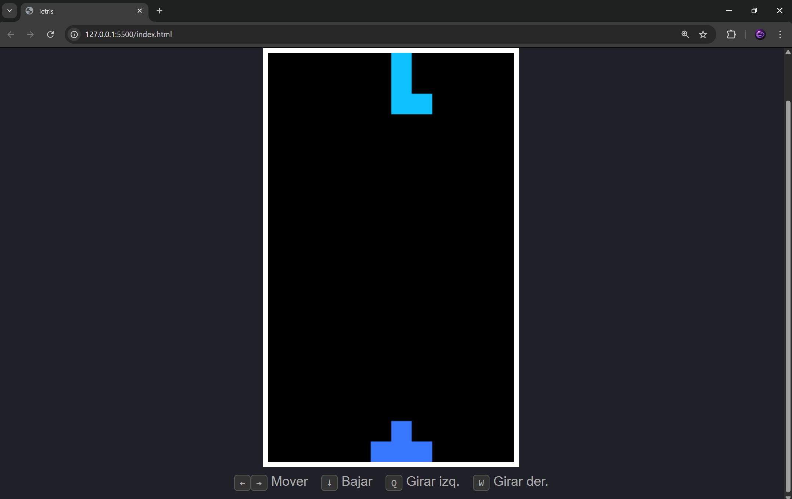

# Tetris

Un tetris hecho en JS puro, sin librerías ni nada raro. Solo tres archivos y listo.

## Cómo correrlo

Descarga los archivos y abre el `index.html` en el navegador, no necesita servidor ni nada.

```
index.html
estilo.css
juego.js
```

## Controles

- `←` `→` — mover
- `↓` — bajar más rápido
- `Q` / `W` — rotar izquierda / derecha

## Puntuación

Eliminar varias filas al mismo tiempo da más puntos. Una fila son 10 puntos, dos filas 30, tres 70, etc. (se duplica cada vez).

## Notas

El juego reinicia solo cuando las piezas llegan hasta arriba y no caben más. No hay pantalla de game over por ahora, simplemente limpia el tablero y vuelve a cero, lo dejo pendiente para después.

Las piezas salen aleatorias, no hay bolsa de 7 ni nada así de fancy, es completamente random.

## Tecnologías

HTML5 Canvas, CSS y JS nada más. Sin frameworks, sin dependencias, sin node_modules que pesen 300mb.

## Imagen


# Pagina

https://tetris-lake-eta.vercel.app/